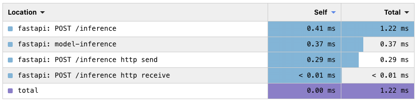
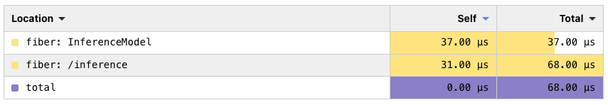

# Fiber Endpoints

### What is this?

A test project for experimenting with a GoLang-based machine learning model endpoints.

### Why does this exist?

The vast majority of machine learning models are trained and inferenced in Python. While the python eco-system supports model training extensively, especially with `C`, `C++` and `Rust` bindings for efficient compute, model inference is often less efficient.

Model inference code is well supported by the aforementioned `C`, `C++` or `Rust` bindings making the code focused on model prediction (e.g. `model.predict()`) efficient. However, as is well known, model code is often less than 5% of a production code base. 

Real-world model infernece often takes the form of an endpoint in an API (most commonly `FastAPI`, `Flask` or `Django`). Often this means that model endpoints are slower due to an overhead of python-based API instructions (e.g. JSON encode/decode, middleware, etc.)  Additionally, the nature of model inference (lots of small calls rather than few large ones), means that a significant portion of the compute workload done by a model endpoint can be computing API work.

This test project aims to test the viability of models trained in python and loaded into non-Python (GoLang) API endpoints and measure their like for like performance.

### How does it work?

A machine learning model (`LightGBM`) has been trained in python, on randomly generated data, and a standard model artefact saved (`model.txt`).

To test the the performance of this model, the following has model endpoints have been written:
- Python `FastAPI` (control)
- GoLang `Fiber`

Each endpoint has an accompanying Dockerfile to run the endpoint (orchestrated with `docker compose`). Once the containers have been run and are live, a benchmarking python notebook makes calls to each model to collect latency data.

# Results

To test each endpoint, the benchmarking notebook makes 100 calls to each model, synchronously. The latency of every 100 calls is captured, and the notebook samples each model 50 times (50*100 calls to each model). The average of these samples is what we take as our result. This provides us some overall performance metrics for each endpoint as though we were making shadow calls to each endpoint and comparing.

Additionally, each endpoint has OpenTelemetry tracing instrumented, with Jaeger collecting metrics. Using Jaeger, we can inspect and compare representative (cherry picking some of the fastest calls) traced calls to compare the latency of inference calling latency of the entire call (the overhead of handling an HTTP call).

The testing methodology here is far from comprehensive nor rigorous, however, this project is simply an experiment and proof of concept.

## End to end latency

Model Endpoint | Mean latency (s) | Median Latency (s) | Mean diff. vs control
--- | --- | --- | ---
Python `FastAPI` (control) | 0.261092 | 0.255399 | -
GoLang `Fiber` | 0.086377 | 0.083931 | 100.56%

## Traced requests

### FastAPI

### Fiber

